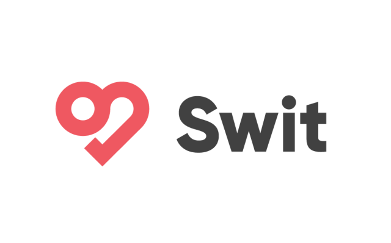
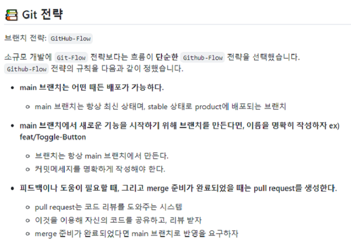
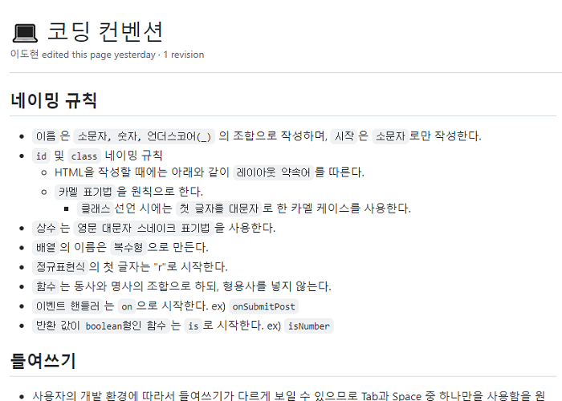
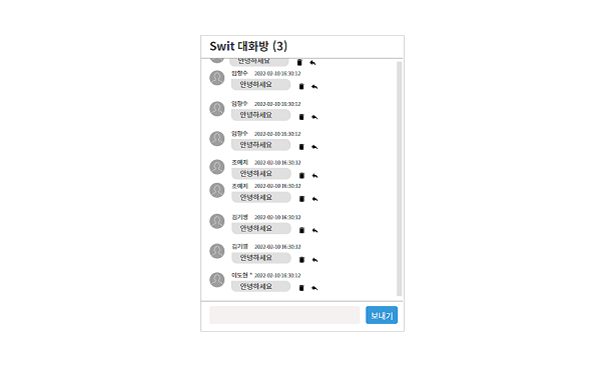
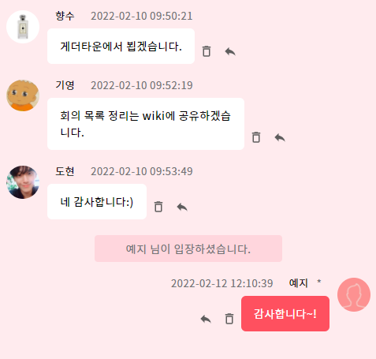
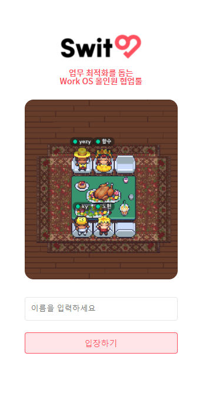

# 📝 원티드 프리 온보딩 2주차 과제 - 메신저 페이지





## 📌배포 링크

- [배포링크](https://elegant-ramanujan-82feb0.netlify.app/)

## 📌프로젝트 소개

- 주요 협업 기능을 하나의 플랫폼에서 제공하는 Swit의 특성을 살린 메신저 기능을 `Redux`를 활용하여 구현하기


## 📌팀원 소개

<table align="center">
<tr >
<td align="center"><a href="https://github.com/perfumelim"></a></td>
<td align="center"><a href="https://github.com/kykim00"></a></td>
<td align="center"><a href="https://github.com/ksmfou98"></a></td>
<td align="center"><a href="https://github.com/yezyvibe"></a></td>
</tr>
<tr>
<td align="center"><b> 임향수 (팀장)</b></td>
<td align="center"><b>김기영</b></td>
<td align="center"><b>이도현</b></td>
<td align="center"><b>조예지</b></td>
</tr>
<tr>
<td align="center"><b>FE Developer</b></td>
<td align="center"><b>FE Developer</b></td>
<td align="center"><b>FE Developer</b></td>
<td align="center"><b>FE Developer</b></td>
</tr>
</table>


## 📌프로젝트 과정 소개

### 			🔖wiki 링크 : https://github.com/2201infinity/swit-messenger/wiki

 - 6번의 팀 미팅과 wiki에 작업 진행 과정을 기록하며 긴밀히 소통하였습니다.
 - github-actions를 통해서 pulll request 시 assignee, reviewer를 자동 지정하도록 자동화 작업 수행하였습니다.


|     🚥Git 커밋 컨벤션 정의     |           🔰코딩 컨벤션 약속을 통한 코드 통일성           |
| :---------------------------: | :------------------------------------------------------: |
|  |  |

|         🧾와이어프레임 제작          | 🦸‍♂️팀원 간 코드 리뷰를 통한 소통🦸‍♀️ |
| :---------------------------------: | :-------------------------------: |
|  |    |


## 📌기능 목록 명세

### ✔ 담당자 : 김기영

- 대화목록
  1. 메시지의 정렬은 과거부터 최신 순으로 정렬
  2. 메시지를 전송 시 대화 목록은 최하단으로 스크롤
  3. 채팅방 입장 시 3명이 주고 받은 5건의 메시지 내용 먼저 출력

### ✔ 담당자 : 이도현

* 메시지

  1. 내가 전송한 메시지의 경우 이름 옆에 * 문자가 출력
  2. 보낸 날짜 yyyy-mm-dd hh:MM:ss 양식으로 출력
  3. 답장을 클릭하면 사용자 이름, 메시지 내용, (회신) 이 순서대로 개행되어 입력창에 자동 삽입 (단, 입력창에 내용존재 시 입력된 내용 앞에 추가)
  4. 삭제 버튼 클릭 시 "메시지를 삭제하시겠습니까?" 라는 메시지가 출력되며 응답시 삭제됩니다. (메시지 내용중 최대 10자까지 출력한 뒤 나머지 ... 처리)

### ✔ 담당자 : 임향수

- 로그인
  1. 사용자가 input창에 입력한 값이 store에 있는 userName에 저장

  2. 이름을 입력하지 않으면 입장이 불가능하며 alert

  3. 입장하기 버튼을 누르거나 엔터를 누르면 메인 페이지로 이동

  4. 헤더 뒤로 가기 버튼을 누르면 로그인 페이지로 이동

### ✔ 담당자 : 조예지

- 입력창
  1. 엔터키 또는 버튼 클릭시 메세지 전송
  2. 메세지 내용 입력 시 전송 버튼 활성화 -> 내용이 없을 시 전송 불가
  3. 입력창은 멀티라인으로 입력 가능 -> 전송 시 메시지에서도 멀티라인 그대로 출력
  
  

## 📌이슈 해결 목록

### 🕵️‍♂️작업 중 고려했던 이슈 목록

* 로그인(유저명 입력) 되지 않을 경우 채팅방 입장 불가
* 메세지 출력시 메세지가 길어지는 경우 줄바꿈 처리
* 답장 중인 메세지의 원본 메세지가 삭제 됐을 시 -> 답장 불가 처리
* 메세지의 개행을 포함하여 멀티라인 메세지 내용 그대로 출력
* 개행 또는 띄어쓰기만 하여 작성 내용 없을 시-> 버튼 비활성화
* 메세지 빠르게 반복 입력 시 스크롤 지연 현상 해결
* 하나의 메세지에 답장하는 도중 다른 메세지의 회신을 또 누른 경우 -> 마지막에 누른 메세지의 답장 내용으로 업데이트
* 답장을 중첩하여 진행하는 경우 -> 마지막 답장 내용만 출력하여, 이전 답장 내역이 반복해서 보이지 않도록 처리


## 📌구현 상세 내용 참고

1. "..." : 메세지 출력 시 10자 이상 기준은 띄어쓰기를 포함하여 구현하였습니다.
 2. 대중적인 메신저 앱을 참고하여 `내가 보낸 메세지`와  `상대방의 메세지`의 UI를 구분하여 구현하였습니다.
    * 상대방 메세지의 경우 -> 기존 명세에 맞춰 프로필 이미지와 메세지 내용을 왼쪽에서 출력함
    * 내가 보낸 메세지의 경우 -> 프로필 이미지와 메세지 내용을 오른쪽에서 출력함



3. 로그인 페이지를 구현하여 실제 채팅앱과 유사한 흐름으로 구현하였습니다.




## 📌프로젝트 설치 및 시작

### 프로젝트 클론

```
$ git clone https://github.com/2201infinity/swit-messenger.git
```

### 패키지 설치

```
$ yarn
```

### 서버 실행

```
$ yarn start
```