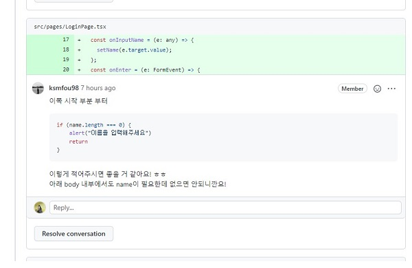

# 📝 원티드 프리 온보딩 2주차 과제 - 메신저 페이지


## 📌배포 링크

- [배포링크](https://elegant-ramanujan-82feb0.netlify.app/)

## 📌프로젝트 소개

- 주요 협업 기능을 하나의 플랫폼에서 제공하는 Swit의 특성을 살린 메신저 기능을 `Redux`를 활용하여 구현하기


## 📌팀원 소개

<table align="center">
<tr >
<td align="center"><a href="https://github.com/perfumelim"></a></td>
<td align="center"><a href="https://github.com/kykim00"></a></td>
<td align="center"><a href="https://github.com/ksmfou98"></a></td>
<td align="center"><a href="https://github.com/yezyvibe"></a></td>
</tr>
<tr>
<td align="center"><b> 임향수 (팀장)</b></td>
<td align="center"><b>김기영</b></td>
<td align="center"><b>이도현</b></td>
<td align="center"><b>조예지</b></td>
</tr>
<tr>
<td align="center"><b>FE Developer</b></td>
<td align="center"><b>FE Developer</b></td>
<td align="center"><b>FE Developer</b></td>
<td align="center"><b>FE Developer</b></td>
</tr>
</table>


## 📌프로젝트 과정 소개

- 6번의 팀 미팅과 wiki에 작업 진행 과정을 기록하며 긴밀히 소통하였습니다.
- github-actions를 통해서 pulll request 시 assignee, reviewer를 자동 지정하도록 자동화 작업 수행하였습니다.

|     🚥Git 커밋 컨벤션 정의     |           🔰코딩 컨벤션 약속을 통한 코드 통일성           |
| :---------------------------: | :------------------------------------------------------: |
|  |  |

|         🧾와이어프레임 제작          | 🦸‍♂️팀원 간 코드 리뷰를 통한 소통🦸‍♀️ |
| :---------------------------------: | :-------------------------------: |
|  |    |


## 📌기능 목록 명세

### ✔ 담당자 : 김기영

- 대화목록
  1. 메시지의 정렬은 과거부터 최신 순으로 정렬
  2. 메시지를 전송 시 대화 목록은 최하단으로 스크롤
  3. 채팅방 입장 시 3명이 주고 받은 5건의 메시지 내용 먼저 출력

### ✔ 담당자 : 이도현

* 메시지

  1. 내가 전송한 메시지의 경우 이름 옆에 * 문자가 출력
  2. 보낸 날짜 yyyy-mm-dd hh:MM:ss 양식으로 출력
  3. 답장을 클릭하면 사용자 이름, 메시지 내용, (회신) 이 순서대로 개행되어 입력창에 자동 삽입 (단, 입력창에 내용존재 시 입력된 내용 앞에 추가)
  4. 삭제 버튼 클릭 시 "메시지를 삭제하시겠습니까?" 라는 메시지가 출력되며 응답시 삭제됩니다. (메시지 내용중 최대 10자 까지 출력 나머지 ... 처리)

### ✔ 담당자 : 임향수

- color, font-size 등 전역적인 스타일링에 활용할 `theme과 global style` 구현

- 상단 헤더 구현

- 사이드메뉴 구현

  - 헤더의 hamburger 버튼 클릭시 사이드메뉴가 열리도록 설정
  - 백그라운드 영역 클릭시 메뉴가 닫히도록 설정

### ✔ 담당자 : 조예지

- 입력창
  1. 엔터키 또는 버튼 클릭시 메세지 전송
  2. 메세지 내용 입력 시 전송 버튼 활성화 -> 내용이 없을 시 전송 불가
  3. 입력창은 멀티라인으로 입력 가능 -> 전송 시 메시지에서도 멀티라인 그대로 출력
  
  

## 📌구현 상세 내용 참고

### 1. "..." : 메세지 출력 시 10자 이상 기준은 띄어쓰기를 포함하여 구현하였습니다.

- figma 상세 이미지를 참고하여 옵션이 1개 이상 선택 가능한 것으로 판단하여 -> 중복 선택 가능하게 필터링함
- 중복 선택할 경우 사용자 경험을 고려하여 체크 된 조건을 모두 만족하는 요청서를 보여주도록 구현


### 2. 로그인 페이지를 구현하여 실제 채팅앱과 유사한 흐름으로 구현하였습니다.


## 📌프로젝트 설치 및 시작

### 프로젝트 클론

```
$ git clone https://github.com/2201infinity/request_a_quote.git
```

### 패키지 설치

```
$ yarn
```

### 서버 실행

```
$ yarn run dev
```